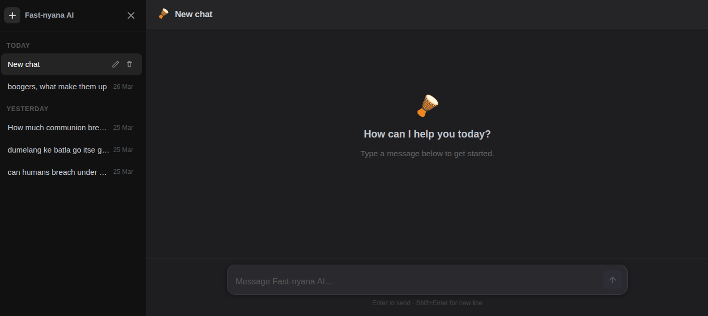

# Hi there 👋, I'm Musa Dondolo

🎓 Final Year BSc Mathematics & Computer Science Student | AI & Web Developer  

💻 I build **AI-powered tools**, **React apps**, and **Python ML projects**. I love solving real-world problems with code.

---

## 🔥 Tech Stack

---

## 🚀 Featured Projects

### 1️⃣ Gemini LLM React App
React web app integrating Hugging Face's Gemini LLM 🔮

  

**Tech Stack:** ReactJS, Hugging Face, TailwindCSS  
**Highlights:**
- Chat with a custom-trained LLM
- Beautiful dark mode UI
- Persistent chat history

[View Repo](https://github.com/dondolo2/ai-chat-app.git)

---

### 2️⃣ Ubuntu Safety Network
GBV safety app built with React Native ⚡

  

**Tech Stack:** React Native, Expo, Firebase  
**Highlights:**
- Alerts contacts when user is in danger
- Clean, responsive mobile UI
- Real-time notifications

[View Repo](https://github.com/dondolo2/ubuntu-safety-network-ReactNative.git)

---

### 3️⃣ AI Resume Analyzer
Python ML app analyzing resumes with Streamlit & scikit-learn 🤖

  

**Tech Stack:** Python, Streamlit, Scikit-Learn, Pandas  
**Highlights:**
- Extracts skills & experience automatically
- Suggests improvements to resumes
- Interactive dashboard with charts

[View Repo](https://github.com/BongiweDipodi/AI-resume-analyzer.git)

---

## 📊 GitHub Stats

---

## 💬 Let's Connect

[LinkedIn](https://linkedin.com/in/yourusername) | [Twitter](https://twitter.com/yourusername) | [Portfolio](https://yourwebsite.com)

---

*“Code is like humor. When you have to explain it, it’s bad.” – Cory House*
